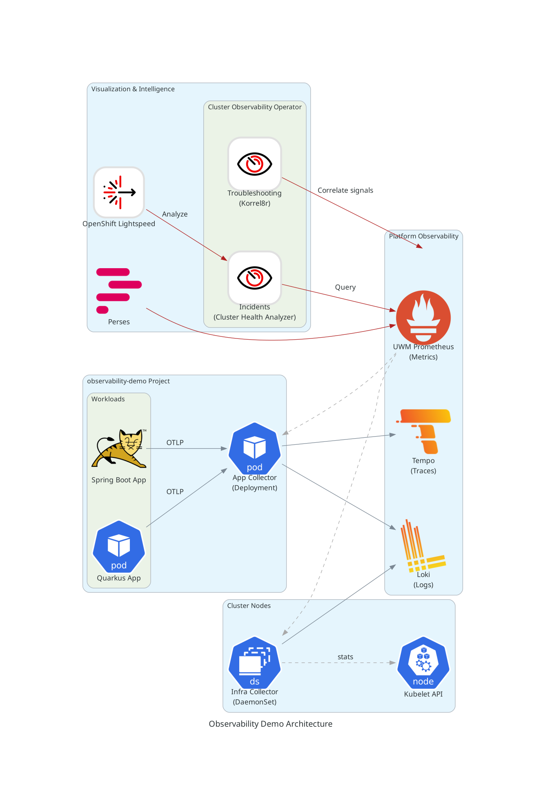

# Observability Demo

## ⚠️ Project Status & Disclaimer
This project is an **explorative demonstration** intended to showcase emerging capabilities within the Red Hat OpenShift Observability ecosystem. It leverages several features that are not yet General Availability (GA).

## Project Overview
The Observability Demo is an implementation for setting up a complete observability stack on **Red Hat OpenShift**. It demonstrates the integration of **OpenTelemetry (OTel)** for the collection of **traces, metrics, and logs**.

The project provides the necessary infrastructure-as-code (manifests) to deploy the operators, configure the OpenTelemetry Collector, and likely includes a sample application (Java/HTML) to generate telemetry data.

## Prerequisites
Before proceeding with the deployment, ensure your environment meets the following requirements:

### Cluster & Infrastructure
- **OpenShift Cluster**: A running OpenShift Container Platform (OCP) cluster.
    - **Version: 4.20.8** (or compatible 4.20+ versions).
- **Object Storage**: Ability to create S3 Buckets (required for Loki and Tempo backend storage).

### Workstation Tools
To run the automation scripts and `Makefile`, your local machine must have:
- OpenShift CLI (`oc`): Configured and logged in to your cluster with `cluster-admin` privileges.
- `yq`: A portable command-line YAML processor (required for parsing and patching manifests).
- `make`: To execute the project's Makefile targets.

## Architecture & Components
The following diagram illustrates the data flow, collection strategies, and the intelligence layer of the demo.



The architecture is divided into four main logical layers:

### Data Sources (`observability-demo` project)
The demo utilizes two interacting services to generate a variety of telemetry signals (Traces, Metrics, Logs), including successful requests, intentional failures, and long-running operations.

#### Spring Boot App (Frontend / Gateway)
Acts as the entry point for user traffic. It is instrumented with Micrometer and OpenTelemetry.
- **POST** `/palindrome`: Purely local logic. Checks if the input string is a palindrome. Generates a single-service trace and logs `INFO` messages.
- **POST** `/analyze`: Initiates a **Distributed Trace**.
    - It accepts a JSON payload, starts a timer, and makes a synchronous HTTP call to the **Quarkus App**.
    - It handles exceptions (Timeouts/500s) from the backend, allowing you to see error propagation in traces.
- **POST** `/stress/{type}`: Acts as a proxy to trigger stress tests on the backend.
#### Quarkus App (Backend / Worker)
Acts as the downstream service.
- **POST** `/analyze`: Contains **Random Chaos Logic** to generate diverse telemetry data:
    - **~33% Chance (Slow)**: Sleeps for 5 seconds before returning. Logs a `WARN`. Useful for demonstrating **Trace Duration** analysis.
    - **~33% Chance (Failure)**: Throws a `RuntimeException`. Logs an `ERROR`. Useful for demonstrating **Error Rate** alerts and traceback analysis.
    - **~33% Chance (Success)**: Returns immediately with a positive sentiment. Logs `INFO`.
- **POST** `/stress/memory`: Triggers a **Memory Leak**. Spawns an async thread that continuously allocates 10MB chunks into a static list (`LEAKY_BUCKET`).
- **POST** `/stress/cpu`: Triggers a **CPU Spike**. Runs a busy-wait loop for 10 seconds.
- **POST** `/reset`: Clears the memory leak and runs garbage collection.
### Collection Layer (OpenTelemetry)
The OpenTelemetry implementation uses two distinct collector patterns to handle different signals and collection constraints.
#### App Collector (Deployment)
This collector runs as a Deployment and aggregates telemetry from the application workloads.
- **Receivers**:
    - **OTLP Receiver**: Accepts Traces, Metrics, and Logs pushed by the Spring Boot and Quarkus applications.
- **Exporters**:
    - **OTLP Exporter (Push)**: Pushes **Traces** to **Tempo** and **Logs** to **Loki**.
    - **Prometheus Exporter (Pull)**: Exposes a `/metrics` endpoint. This is required because the OpenShift **User Workload Monitoring (UWM)** stack currently relies on a pull model and cannot yet accept OTLP push for metrics (i.e., `enable-otlp-receiver` is not set).
#### Infra Collector (DaemonSet)
This collector runs on every node to capture infrastructure-level signals.
- **Receivers:**
    - **Kubelet Stats Receiver:** Configured to scrape metrics specifically for **Pods** and **Containers**.
    - *Note*: It does not collect host/node-level metrics, focusing instead on the Kubernetes objects (see `infrastructure/02-demo-app/04-infra-collector.yaml`).
- **Exporters:**
    - **Prometheus Exporter**: Exposes these statistics for UWM scraping.
### Platform Observability
The data is stored and analyzed using the Red Hat OpenShift observability ecosystem:
- **UWM Prometheus**: Stores application and infrastructure metrics.
- **Tempo**: Distributed tracing backend. **Uses S3 Object Storage**.
- **Loki**: Log aggregation system. **Uses S3 Object Storage**.
- **Cluster Observability Operator (COO)**:
    - **Troubleshooting (Korrel8r)**: A correlation engine that links signals (e.g., finding logs, traces and metrics associated with a specific pod).
    - **Incidents (Cluster Health Analyzer)**: Analyzes metrics to detect and surface cluster health issues.
### Visualization & Intelligence
- **Perses**: A dashboarding tool querying UWM Prometheus for metrics visualization.
- **OpenShift Lightspeed (OLS):** The conversational AI interface for the cluster. It acts as the MCP host, orchestrating interactions with available MCP servers to answer complex user queries.
- **MCP Servers (Model Context Protocol):**
    - **Role:** These provide a standardized bridge between OLS and the underlying observability data.
    - **Incidents Server:** Exposes cluster health and alert data (from Cluster Health Analyzer) to OLS.
    - **Tempo Server:** Exposes distributed tracing data to OLS, allowing it to fetch and analyze trace spans stored in S3.
    - *Extensibility:* The architecture allows for adding more MCP servers (e.g., for Loki or generic Kubernetes resources) to further enhance OLS's capabilities.
## Installation Guide
This project uses a `Makefile` to automate the deployment of operators, infrastructure, and the demo applications.
### Step 1: Storage Configuration
**Critical Prerequisite:** The observability stack (Tempo, Loki) requires Object Storage.
- **Option A: Cluster-Provided Object Storage (e.g ODF)**
    - **Scenario 1: OpenShift Data Foundation (ODF)**
        - The manifest `infrastructure/01-platform/01-storage-claims.yaml` is pre-configured for ODF (defaulting to `openshift-storage.noobaa.io`).
        - **Action:** If you have ODF installed, **no modification is required**.
    - **Scenario 2: Other Storage Providers**
        - If your cluster uses a different provider that exposes an Object Store via a StorageClass (e.g., MinIO operator, specific Cloud provider classes), you must update the manifest.
        - **Action:** Edit `infrastructure/01-platform/01-storage-claims.yaml` and change the storageClassName to match your cluster's specific storage class.
- **Option B: External S3 (e.g., AWS)**
    - If you are bringing your own existing S3 buckets, the default ObjectBucketClaim (OBC) manifests will not work.
    - **Action**: You may need to manually create the necessary `Secrets` containing your bucket credentials and endpoints and modify the `Makefile` logic to skip the OBC creation steps.
### Step 2: Deploy All Components
You can choose to deploy the full stack with or without the OpenShift Lightspeed (OLS) integration. This command will install the Operators, configure the Collectors and Storage, and deploy the demo services.

#### Option A: Standard Deployment (No AI/OLS)
Use this command if you do not have an LLM provider key or do not wish to enable the conversational interface.
```bash
make deploy-all
```

#### Option B: Full Deployment (With AI/OLS) 
Use this command to enable OpenShift Lightspeed. You must provide your LLM credentials.
```bash
make deploy-all \
  LLM_API_TOKEN=sk-your-token-here... \
  LLM_URL=https://api.your-provider.com/v1/...
```
## Verification
Follow these steps to generate traffic and verify that the observability pipeline is functioning correctly.

### 1. Verify Workloads
First, ensure that the application services and the OpenTelemetry collectors are running:

```bash
oc get pods -n observability-demo
```

*Expected Output*: You should see **virt-launcher-frontend-tomcat-vm**, **quarkus-backend**, **otel-app-collector** (Deployment), and **otel-infra-collector** (DaemonSet) in the `Running` state.

### 2. Generate Telemetry Data
You can generate telemetry data either by interacting with the application's Frontend or by using the provided load generation script.

**First, retrieve the Application URL:**
```bash
export APP_URL=https://$(oc get route frontend-tomcat-service -n observability-demo -o jsonpath='{.spec.host}')
echo "App URL: $APP_URL"

```
#### Option A: Use the Web UI
Open the `$APP_URL` in your browser. The frontend provides a simple interface to trigger the various endpoints:

- **Analyze:** Triggers the distributed tracing chain (Spring Boot → Quarkus).
- **Palindrome:** Triggers local logic.
- **Stress Tests:** Specific buttons to trigger CPU or Memory stress on the Quarkus backend.
#### Option B: Use the Automation Script
A helper script is provided in `scripts/stress.sh` to automate load generation and chaos scenarios.

Make the script executable:

```bash
chmod +x scripts/stress.sh
```

**Run Test Scenarios:**
- **Continuous Traffic (Default):** Generates a steady stream of requests to the `/analyze` endpoint. This is best for populating Tempo with traces.

```bash
./scripts/stress.sh $APP_URL analyze
```
- **CPU Stress (Latency/Throttling):** Triggers parallel requests to burn CPU on the backend. Useful for observing latency spikes and CPU metrics in UWM/Lightspeed.

```bash
# Default: 3 parallel requests
./scripts/stress.sh $APP_URL overload_cpu requests
```

- **Memory Leak (OOM/Crash Loop)**: Forces the backend to allocate large chunks of memory (approx. 200MB per request). Use this to test OOM alerts or container restarts.

```bash
# Default: 2 allocations (~400MB total)
./scripts/stress.sh $APP_URL overload_memory requests
```

- **Reset Backend**: Clears the memory leak and triggers Garbage Collection.

```bash
./scripts/stress.sh $APP_URL reset
```

### 3. Verify Observability Signals
Navigate to the OpenShift Console to confirm the data has arrived:
- **Traces (Tempo)**:
    - Go to **Observe > Traces**.
    - Select **openshift-tracing/platform** as the Tempo instance and **platform** as tenant.
    - You should see distributed traces showing the hop between the Spring Boot and Quarkus apps.
- **Logs (Loki):**
    - Go to **Observe > Logs**.
    - Filter by namespace="observability-demo".
    - Verify that application logs (e.g. "Analysis request received") are being forwarded.
- **Metrics (Prometheus)**: You can verify metrics in two ways:
    1. **Console Query**:
        - Go to **Observe > Metrics**.
        - Query for custom metrics.
    2. **Perses Dashboard:** The demo includes a custom Perses dashboard named *Workload Details (Hybrid Cloud)*. This dashboard queries the `uwm-thanos` datasource to visualize both application and infrastructure performance. You can get the hostname using: `oc get route perses-demo -n observability-demo -o jsonpath='{.spec.host}`

## Caveates
### Troubleshooting Plugin Manual Configuration
The **Troubleshooting** console plugin (Dynamic Plugin) currently requires manual installation and configuration.
- **Issue:** The **Cluster Observability Operator (COO)** does not yet support injecting the Korrel8r configuration via a `ConfigMap`.
- **Impact:** This configuration is critical for defining the specific LogQL queries that allow the plugin to correlate OpenTelemetry-collected logs with traces. Without it, the "Logs" tab in the Troubleshooting view may not correctly filter logs for a specific trace ID.
- **Workaround:** Deploy Korrel8 and Troubleshooting panel plugin manually.
### Platform Tenant Requirement for Metrics
To use **Korrel8r** and the UI Troubleshooting plugin effectively, you must direct all trace data to the `platform tenant.
- **Issue:** These tools currently do not propagate tenant information in their interaction. They assume `platform` as default tenant. 
- **Workaround:** Using `platform` tenant for traces.
### Tempo Integration & mTLS
The **Tempo Stack Gateway** does not currently route traffic to the **Model Context Protocol (MCP)** endpoints (/api/mcp/*).
- **Issue:** The MCP API is hosted directly on the **Query Frontend** component, but the standard Gateway entry point does not expose these routes to external clients. The Query Frontend service itself is internal and protected by strict mutual TLS (mTLS).
- **Impact:** OLS cannot connect to Tempo via the standard public Gateway or Route. It requires direct access to the internal Query Frontend.
- **Workaround:** An Ambassador Pattern (via an Nginx adapter) is required to bridge this gap. This adapter:
    1. Proxies OLS requests directly to the internal Query Frontend service.
    2. Handles the strict **Internal mTLS** handshake required by Tempo components (using the internal Tempo CA), effectively translating the connection for OLS.